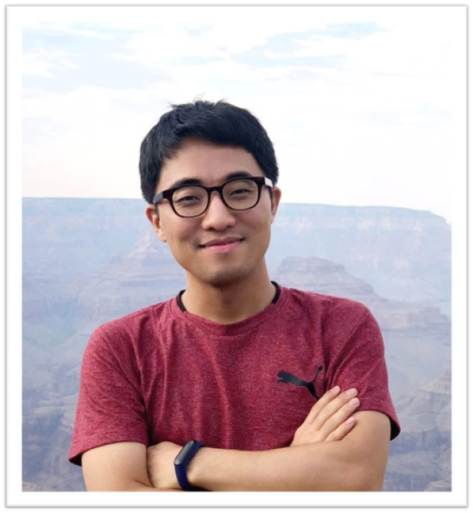

# Talk: "AI Research in Agriculture and Beyond &mdash; Successful Machine Learning under Limited Resources"

(업데이트: 2021년 11월 4일)

- **일시:** 2021년 12월 중

- **장소:** 한경대학교 

- **발표자:** 최태영 박사 
  - 현재 영국 링컨대학교 Lincoln Institute for Agri-Food Technology 박사후연구원 
  - 2020년 미국 애리조나주립대학교 PhD in Computer Science 졸업
  - 2015년 숭실대학교 컴퓨터학부 졸업

- **요약:** 
  - 최근 딥러닝 기술을 토대로 컴퓨터비전, 자연어처리, 로봇, 농업, 자연과학 등에서의 활발한 AI연구가 진행되고 있다. 
  두번에 걸친 본 발표에서는 학계에서 주목하고 있는 딥러닝과 관련한 다양한 연구주제들에 대한 전반적인 소개와 더불어, 실용적인 &mdash; 즉, 자원이 제한적인 상황에서의 &mdash;머신러닝 알고리즘의 설계 방법들에 대해 소개한다. 예를들어, 1) 일부 감지해야 하는 클래스의 데이터가 사전에 얻기 어려운 경우, 2) 로봇 제어를 위해 사람의 개입이 반복적으로 필요한 경우, 3) 로봇이 전지역을 직접 방문, 모니터링하기에는 시간/배터리 등이 제한적인 경우에 활용 가능한 효과적인 방법론에 대해 살펴본다. 특히, Generative Adversarial Network (GAN), 자기지도학습 (Self-supervise Learning), 강화학습 (Reinforcement Learning), 가우시안프로세스 회귀 (Gaussian Process Regression) 등을 기반으로 한 성공적인 활용법이 다뤄질 예정이며, 이중 일부는 발표자의 현재 연구분야인 농업로봇과 관련한 사례로 보다 심층적으로 다뤄질 예정이다. 

  - **발표 I:** *"Anomaly Detection in Computer Vision"*
  - **발표 II:** *"Active Learning in Robotics"*

